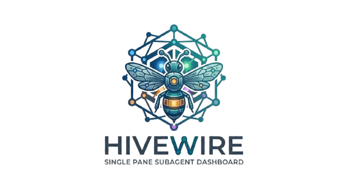
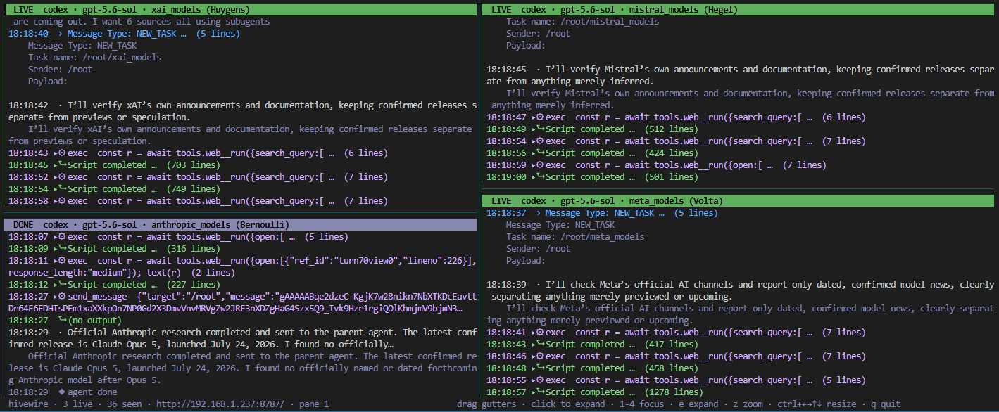
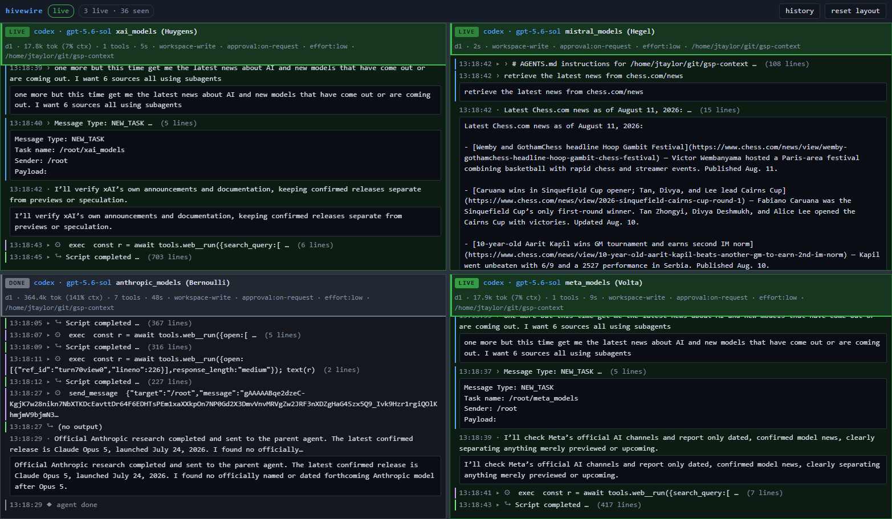

<p align="center">
  
</p>

Live, raw view of what your **Claude Code**, **Codex** and **OpenCode** subagents are
doing — four panes at a time, in a terminal UI and a LAN-reachable web page, from one
binary.

Existing agent dashboards are hook-fed event feeds. Hooks only carry tool names and
tool results, so they structurally cannot show assistant text, reasoning, or token
usage. hivewire instead reads the history all three CLIs already keep, which contains
everything — and needs no configuration in any of them to do it.


## Run it

```sh
go build -o hivewire .
./hivewire                    # TUI + web on 0.0.0.0:8787
./hivewire --tui=false        # web only (headless box)
./hivewire --web=false        # terminal only
```

Then open `http://<this-host>:8787/` from any machine on the LAN.

New subagents appear automatically. Transcripts that already existed when hivewire
started are indexed for the history browser but never take a live pane, so launching
it does not replay everything you have ever run.

## Pane details

| Field | Claude | Codex | OpenCode |
|---|---|---|---|
| status dot | green live · gray done · red error | same | same |
| provider · model | `message.model` | `turn_context.model` | `session.model` |
| agent | `agentType` | `basename(agent_path)` + nickname | `session.agent` |
| title | Task `description` | first task message | `session.title` |
| depth | `spawnDepth` | `thread_spawn.depth` | parent chain length |
| tokens | summed `usage` | `token_count` totals + context-window % | `session.tokens_*` |
| tools, elapsed | derived | derived | derived |
| context | `cwd`, git branch, `sessionKind`, `effort` | `cwd`, sandbox policy, approval mode, reasoning effort | `session.directory`, CLI version |

### TUI

<p align="center">
  
</p>

### GUI

<p align="center">
  
</p>

## Where the data comes from

No hooks, no config changes to any of the CLIs, nothing to install in them.

**Claude Code** writes one dedicated JSONL per subagent:

```
~/.claude/projects/<slug>/<session>/subagents/agent-<id>.jsonl
~/.claude/projects/<slug>/<session>/subagents/agent-<id>.meta.json   ← agentType, description, toolUseId, spawnDepth
```

Completion is read from the parent transcript (`~/.claude/projects/<slug>/<session>.jsonl`),
whose `tool_result` for that `toolUseId` says exactly when the agent finished and
whether it errored — more reliable than an idle timer.

**Codex** writes one rollout JSONL per thread:

```
~/.codex/sessions/YYYY/MM/DD/rollout-<ts>-<thread id>.jsonl
```

A subagent is a thread whose `session_meta` has `thread_source == "subagent"`; that
same first line carries `parent_thread_id`, `depth`, `agent_path` and `agent_nickname`.
Completion comes from the rollout's `task_complete` event. (`thread_spawn_edges.status`
in `~/.codex/state_5.sqlite` stays `"open"` after completion, so it is not used.)

**OpenCode** keeps no per-subagent transcript. Everything lives in its SQLite
database:

```
~/.local/share/opencode/opencode.db      # session, message, part tables
```

A subagent is a session with a non-empty `parent_id`. hivewire opens the database
read-only (`mode=ro`, `query_only`, pure-Go driver — no CGO, no `sqlite3` binary,
never a migration) and follows each child session with a cursor over `time_updated`.
Rows mutate in place as a turn runs, so a tool part is streamed as an invocation when
it first appears and as a result once it completes. Completion comes from the newest
message's `finish` and `time.completed`, with the same idle timer as a fallback.
Because text and reasoning are persisted per completed part rather than per token,
OpenCode output appears at part boundaries, not character by character.

Adding a provider means implementing `provider.Provider` — discover agents, emit
`model.Agent` + `model.Event`.

## Nothing is truncated

Measured across ~950 real tool results on a working box: p50 375 B, p90 2.5 KB,
p99 13 KB, max 45 KB — because both CLIs already cap tool output before writing it.
hivewire therefore stores every event whole; the per-agent ring buffer (default 8 MB)
exists only as a runaway guard, and if it ever wraps it logs an error and marks the
pane title bar so the loss is never silent.

Long bodies are *folded*, not cut: click a header to expand. Folding triggers on
byte size as well as line count — a 140 KB tool result that arrives as a single
line has `Lines == 1` and would otherwise be pasted straight into a pane. When
the CLI itself truncated something, the transcript names the overflow file on
disk, and hivewire shows a **load full output** button that reads the real bytes
back.

The terminal renderer additionally caps what it *draws* (500 lines per expanded
body, 4000 per pane) and caches each pane's wrapped lines until something
changes. None of this discards data — the full event is always in the buffer and
in the web UI.

## Controls

Mouse and keyboard both work, everywhere.

| | TUI | Web |
|---|---|---|
| resize panes | drag a gutter, or `ctrl+←→↑↓` | drag a gutter |
| focus a pane | click, `1`-`4`, `tab` | — |
| expand a block | click its header, or `e` for all | click its header |
| scroll | wheel, `↑↓`/`jk`, `pgup`/`pgdn`, `g`/`G` | wheel |
| zoom a pane | `z` | — |
| reset layout | `r` | reset layout button |
| history | — | history button |
| quit | `q` | — |

Pane proportions persist: `~/.local/state/hivewire/layout.json` for the TUI,
`localStorage` for the browser. The TUI status bar shows the web UI's URL
alongside the live/seen counts and the key hints.

## Slots

Four fixed slots. A finished agent keeps its pane until a new agent needs one, at
which point the oldest *finished* pane is recycled. A live agent is never evicted —
if all four are live, the newcomer waits in the pending strip and takes the first
slot to free up.

## Status is the whole panel

A coloured dot is too easy to miss across four panes, so state drives everything:
the web pane's background, header bar and border all shift together (green live /
grey done / red errored) behind a spelled-out `LIVE` / `DONE` / `ERROR` chip. The
TUI does the same with a filled title bar and a coloured rail down the left of the
pane body. In a narrow pane the title is shed before the status or the
dropped-events warning — those two never go silent.

## History

Every CLI keeps its own history indefinitely, so hivewire copies nothing. The
history browser is an index (`~/.local/state/hivewire/index.json`, rebuildable) over
records that already exist, and replay re-reads the original transcript — or, for
OpenCode, the original database rows.

The search box queries the server, so it matches **every** indexed run rather than
the page on screen, and every whitespace-separated term must match. Fields
searched: title, prompt, agent name and nickname, model, provider, cwd, status.
Results page 50 at a time behind a **view more** button.

Prompts are indexed even for transcripts that predate hivewire: discovery sniffs
the head of each pre-existing transcript (bounded to 200 lines) purely to recover
the prompt and model, without streaming it into a pane.

**Codex caveat.** For a subagent spawned from an interactive codex session, the
task it was handed is encrypted in the rollout — only a routing envelope naming
the agent is plaintext, and the parent thread has no plaintext copy either. Such
runs are searchable by agent name, model and cwd, but not by prompt. Everything
the subagent *does* — tool calls, outputs, its messages — is plaintext and streams
normally. Subagents forked by `codex exec` inherit the parent's prompt, which is
indexed.

Codex reasoning is encrypted unless summaries are enabled. hivewire already
renders reasoning as its own event kind, so turning them on makes it visible:

```sh
codex -c model_reasoning_summary=auto   # auto | concise | detailed | none
```

## Configuration

Flags override `~/.config/hivewire/config.toml` (or `$HIVEWIRE_CONFIG`):

```toml
slots        = 4
web          = true
tui          = true
addr         = "0.0.0.0"
port         = 8787
buffer_bytes = 8388608
poll_ms      = 250
idle_done_sec = 300      # fallback only; real completion comes from the transcripts
claude_root  = "~/.claude/projects"
codex_root   = "~/.codex/sessions"
opencode_db  = "~/.local/share/opencode/opencode.db"
state_dir    = "~/.local/state/hivewire"
```

## Security

The web server binds `0.0.0.0` with **no authentication and open CORS**, by design —
it is meant to be opened from another machine on your LAN. Anyone who can reach the
port can read your agent transcripts, including prompts, file contents, and anything
an agent printed. Run it on a trusted network only. Overflow-file reads are confined
to the configured transcript roots, with symlinks resolved before the check.

hivewire never writes to the OpenCode database: it is opened read-only with
`query_only` set, and a missing database is simply no OpenCode agents rather than an
error. Only the `tool-output` directory beside the database is an allowed
overflow root — the database's own directory is not, because it also holds
`auth.json`.
